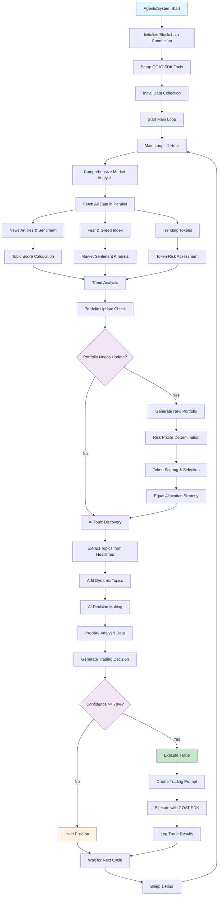

# Paperhead Agentic Trading System Flow

## Overview

Paperhead is an autonomous AI-powered Solana trading agent that uses a single-loop architecture to continuously monitor market conditions, analyze trends, and execute trades with high confidence. The system combines real-time data from multiple sources with GPT-4o analysis to make intelligent trading decisions.

## Architecture Components

### Core System: AgenticSystem
- **Location**: `src/agent/agenticSystem.ts`
- **Purpose**: Main orchestrator that coordinates all services and executes the trading logic
- **Key Features**: Single-loop architecture, AI-powered decision making, risk management

### Data Services
1. **NewsService** (`src/services/newsService.ts`)
   - Fetches crypto news and sentiment data from RapidAPI
   - Provides Fear & Greed Index analysis
   - Batch processing for optimal performance

2. **TopicGenerator** (`src/services/topicGenerator.ts`)
   - Manages 90+ predefined Solana topics
   - AI-powered dynamic topic discovery from headlines
   - Categorizes topics by DeFi, memecoins, infrastructure, etc.

3. **TrendAnalyzer** (`src/services/trendAnalyzer.ts`)
   - Historical trend analysis and momentum scoring
   - Sentiment trend calculation
   - Market condition assessment (bullish/bearish/neutral)

4. **TrendingTokensService** (`src/services/trendingTokensService.ts`)
   - Tracks trending Solana tokens from SolanaTracker API
   - Risk assessment and opportunity analysis
   - Liquidity and momentum calculations

5. **PortfolioService** (`src/services/portfolioService.ts`)
   - AI-powered portfolio construction
   - Risk-adjusted token selection
   - Equal allocation strategy with confidence scoring

### Trading Integration
- **GOAT SDK**: Solana blockchain interaction
- **Jupiter Plugin**: DEX aggregation for optimal swap rates
- **Orca Plugin**: Direct pool access for liquidity operations
- **Confidence Threshold**: 70% minimum for trade execution

## System Flow Diagram



## Detailed Flow Explanation

### 1. System Initialization
- **Blockchain Setup**: Creates Solana connection and keypair from environment variables
- **GOAT SDK Configuration**: Initializes Jupiter and Orca plugins for trading
- **Initial Data Collection**: Fetches baseline data for topics, sentiment, and Fear & Greed Index

### 2. Main Loop Architecture

#### Main Loop (1 Hour Cycle)
**Purpose**: Comprehensive market analysis and trading decisions

**Steps**:
1. **Parallel Data Fetching**: 
   - News articles for selected topics (15 topics max per cycle)
   - Market sentiment data (24h/48h intervals)
   - Fear & Greed Index (today vs yesterday)
   - Trending tokens from SolanaTracker

2. **Data Processing**:
   - Calculate topic popularity scores (0-100 based on article count)
   - Analyze sentiment trends and changes
   - Assess Fear & Greed momentum
   - Evaluate token risk and opportunity scores

3. **Portfolio Management**:
   - Check if portfolio update is needed (every 2 hours or on significant market changes)
   - Generate new equal-allocation portfolio if required
   - Select 5 tokens based on risk profile (conservative/moderate/aggressive)

4. **AI Topic Discovery**:
   - Extract trending keywords from news headlines using GPT-4o-mini
   - Add dynamic topics to the monitoring list
   - Clean up old dynamic topics

5. **Trading Decision**:
   - Prepare comprehensive analysis report
   - Generate trading decision using GPT-4o-mini
   - Execute trades only if confidence >= 70%

### 3. Data Sources and APIs

#### News and Sentiment
- **RapidAPI Crypto News**: Real-time crypto news with sentiment analysis
- **Fear & Greed Index**: Market psychology indicator
- **Parallel Processing**: All data fetched simultaneously for efficiency

#### Token Data
- **SolanaTracker API**: Trending tokens, price changes, liquidity
- **Risk Assessment**: 1-10 risk scoring based on multiple factors
- **Opportunity Analysis**: Momentum, volume, and technical indicators

### 4. AI Decision Making

#### Analysis Preparation
Comprehensive market report including:
- Top 5 trending topics with momentum scores
- Market sentiment percentages and trends
- Fear & Greed classification and changes
- Token market analysis (bullish/bearish/neutral)
- Top momentum tokens with 1-hour performance
- Low-risk and high-liquidity token recommendations
- Trading signals based on multiple indicators

#### Decision Generation
- **Model**: GPT-4o-mini for cost-effective analysis
- **Input**: Formatted analysis report with all market data
- **Output**: JSON decision with action (buy/sell/hold), token, amount, confidence, reasoning
- **Validation**: Confidence threshold and risk management checks

### 5. Trade Execution

#### Pre-execution Checks
- Confidence score >= 70%
- Action is not 'hold'
- Risk amount <= 10% of portfolio

#### Execution Process
1. **Trading Prompt**: Generate detailed instructions for AI trading agent
2. **GOAT SDK Integration**: Execute trades through Jupiter/Orca protocols
3. **Multi-step Process**: Balance check, amount calculation, trade execution
4. **Result Logging**: Comprehensive transaction summary

### 6. Risk Management

#### Portfolio Level
- **Maximum Allocation**: 10% per individual trade
- **Risk Profiling**: Conservative/moderate/aggressive based on market conditions
- **Diversification**: Avoid concentration in similar tokens

#### Token Level
- **Risk Scoring**: 1-10 scale based on multiple factors
- **Liquidity Requirements**: Minimum thresholds for safe trading
- **Authority Checks**: Mint/freeze authority validation

#### Market Level
- **Sentiment Alignment**: Adjust strategy based on market conditions
- **Fear & Greed Integration**: Contrarian and momentum strategies
- **Trend Confirmation**: Multiple timeframe analysis

### 7. Performance Monitoring

#### System Metrics
- **Loop Timing**: Main (1h) and Quick (15min) cycle performance
- **API Success Rates**: Monitor external service reliability
- **Decision Accuracy**: Track confidence vs. actual performance

#### Trading Metrics
- **Execution Success**: Trade completion rates
- **Risk Metrics**: Portfolio risk distribution
- **Performance Tracking**: Historical decision outcomes

## Key Features

### 1. Adaptive Topic Discovery
- **Base Topics**: 90+ predefined Solana ecosystem keywords
- **Dynamic Topics**: AI extracts trending terms from headlines
- **Categorization**: DeFi, memecoins, infrastructure, gaming, NFTs, tools

### 2. Multi-source Data Integration
- **News Sentiment**: Real-time crypto news analysis
- **Market Psychology**: Fear & Greed Index tracking
- **Token Metrics**: Price momentum, liquidity, risk assessment
- **Trend Analysis**: Historical data and momentum scoring

### 3. Confidence-based Execution
- **High Threshold**: 70% minimum confidence for trades
- **Risk Management**: Maximum 10% allocation per trade
- **Conservative Approach**: Prefer holding to risky trades

### 4. Intelligent Portfolio Construction
- **Equal Allocation**: Balanced risk distribution
- **Risk-adjusted Selection**: Tokens chosen based on market conditions
- **Comprehensive Scoring**: Sentiment, momentum, confidence, and risk factors

### 5. Real-time Monitoring
- **Continuous Operation**: 24/7 market monitoring
- **Quick Response**: 15-minute high-priority topic checks
- **Comprehensive Analysis**: Hourly deep market analysis

## Technical Implementation

### Environment Requirements
- Node.js 18+ with ES modules
- TypeScript with strict mode
- Solana Web3.js and GOAT SDK
- OpenAI GPT-4o integration via Vercel AI SDK

### Configuration
```env
OPENAI_API_KEY=sk-...
SOLANA_RPC_URL=https://api.mainnet-beta.solana.com
SOLANA_PRIVATE_KEY=base58_encoded_private_key
RAPID_API_KEY=rapidapi_key
SOLANA_TRACKER_API_KEY=solanatracker_api_key
```

### Entry Points
- **Production**: `src/main.ts` - Full system startup
- **Development**: `src/agent/index.ts` - Agent-only mode
- **Testing**: Individual service testing available

This autonomous trading system represents a sophisticated approach to cryptocurrency trading, combining multiple data sources, AI analysis, and risk management to operate continuously in the volatile Solana ecosystem.